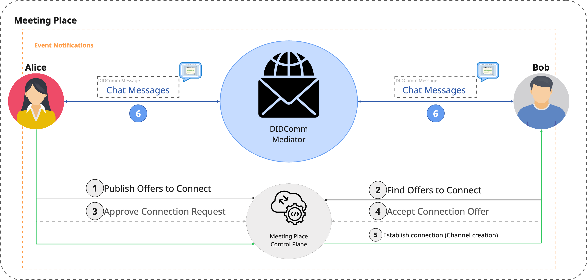
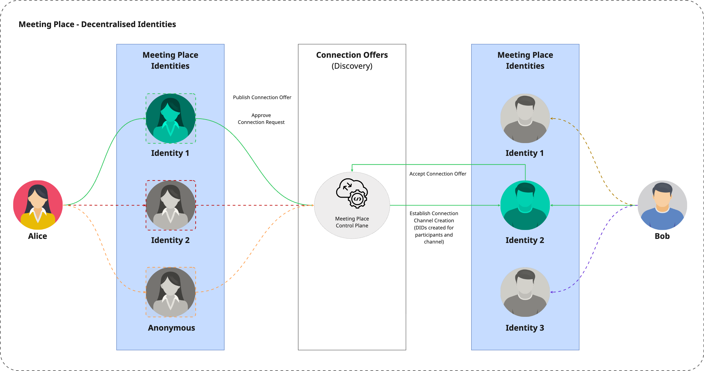
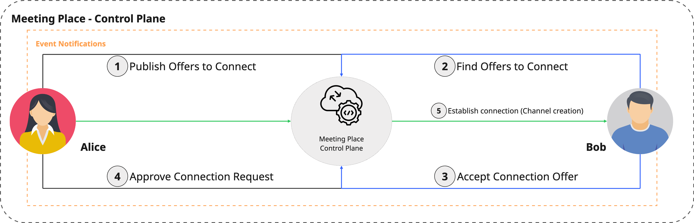
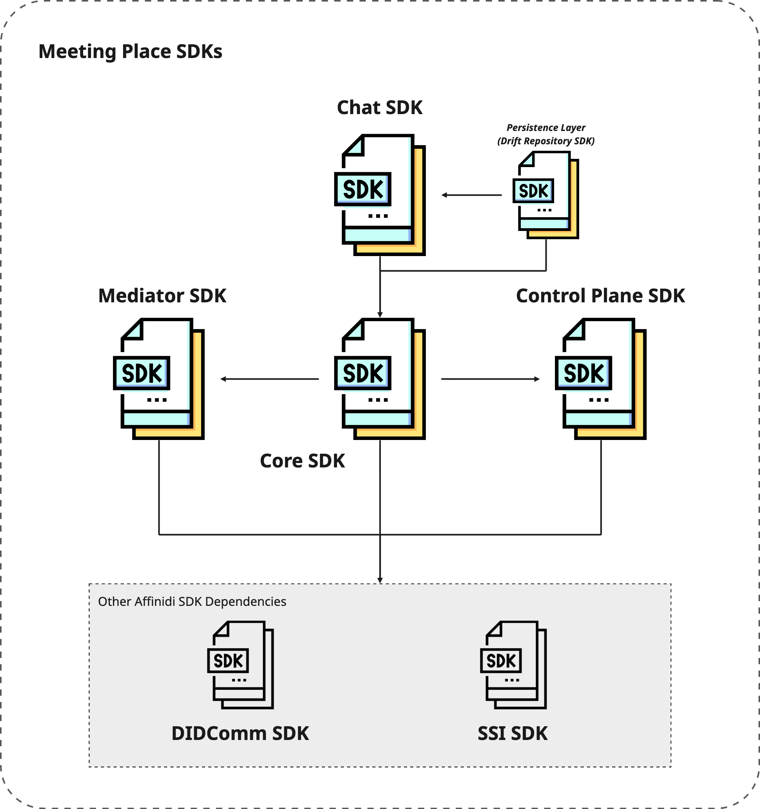

# Affinidi Meeting Place SDK

Affinidi Meeting Place SDK provides the toolkits to build a messaging app for a safe and secure method to discover, connect, and communicate between individuals, businesses, and AI agents using [Decentralised Identifiers (DIDs)](https://www.w3.org/TR/did-1.0/) and [DIDComm v2.1 protocol](https://identity.foundation/didcomm-messaging/spec/v2.1/). DIDComm v2.1 protocol enables a secure and private communication between entities using Decentralised Identifiers (DIDs) as the basis of the user's identity when communicating, instead of the usual email address or phone number.

Using the decentralised approach in communication, all users have control over their identity, giving them better privacy and anonymity when required. Meeting Place SDK facilitates seamless, secure, and authentic communication between humans, AI agents, robots, and organisations, ensuring trust in digital interactions.

> **DISCLAIMER:** Affinidi provides this SDK as a developer tool to facilitate decentralized messaging. Any personal data exchanged or stored via this tool is entirely initiated and controlled by end-users. Affinidi does not collect, access, or process such data. Implementing parties are responsible for ensuring that their applications comply with applicable privacy laws and user transparency obligations.

## Meeting Place Overview Flow



Before participants can securely and privately communicate with each other in Meeting Place, they have to publish a connection offer using one of their identities created in Meeting Place. For example, you can create an identity you want to use when communicating with gaming friends. Upon acceptance of the connection offer and approval from the publisher of the offer, a connection is established between the two participants and creates the following DIDs:

- Channel DID to establish the connection.
- Alice and Bob's DID with their selected identity for this channel.

Leveraging the DID and DIDComm protocol guarantees:

- Authenticity – Messages come from who they claim to be.
- Confidentiality – End-to-end encryption prevents leaks.
- Non-repudiation – Sender can't deny sending a message.

### Decentralised Identity

Using other chat applications, you usually register with your email address or phone number as your identifier, which exposes users to privacy risks. Meeting Place allows users to have multiple identities to represent themselves in various digital interactions, depending on the context.



Each connection established with another participant, whether direct or in a group chat, generates a unique set of Decentralised Identifiers (DIDs). This dynamic DID assignment **enhances user privacy** by separating identity contexts across different interactions.

- Channel DID to establish the connection.
- DIDs for participants within the established channel with their selected identity.

### Discovery

The discovery through the Control Plane facilitates the secure discovery and establishment of a connection between participants in Meeting Place.



The Control Plane API facilitates the **discovery** and **creation of secure channels** between participants in Meeting Place to exchange messages using the DIDComm v2.1 protocol. The Control Plane API enables participants to publish a connection offer or invitation using one of their identities (e.g., an identity for your gaming persona) for direct or group chat to allow discovery by other participants and initiate a connection request to start chatting with them through a secure channel.

A published invitation contains a description, validity, and a vCard containing additional information - it is up to the participants to provide more details or restrict the details to protect their privacy.

## Core Concepts

- **Decentralised Identifier (DID)** - A globally unique identifier that enables secure interactions. The DID is the cornerstone of Self-Sovereign Identity (SSI), a concept that aims to put individuals or entities in control of their digital identities.

- **DIDComm Message** - is a JSON Web Message (JWM), a lightweight, secure, and standardised format for structured communication using JSON. It represents headers, message types, routing metadata, and payloads designed to enable secure and interoperable communication across different systems.

- **Mediator** - A service that handles and routes messages sent between participants (e.g., users, organisations, another mediator, or even AI agents).

- **Out-Of-Band** - The protocol defined in DIDComm enables sharing a DIDComm message or invitation through a transport method other than a direct, established DIDComm channel, such as via a QR code or a URL.

- **Connection Offer** - An invite to connect containing description and vCard info of the publisher. Each connection offer is assigned with a unique passphrase that others can use to discover and accept the offer to connect.

## Key Features

- Support for multiple digital identities, ensuring privacy and anonymity when interacting with different entities across systems.
- End-to-end encryption of messages for more secure and private communication.
- Reduces spam by requiring the user's consent when other users try to establish a connection.
- Implement the DIDComm Message v2.1 protocol, and connect and authenticate with different mediators that follow the same protocol.
- Seamlessly integrates with Self-Sovereign Identity (SSI), including Verifiable Credentials/Presentations.

## Key Components

Below are the key components of the Meeting Place SDK. Depending on your use case, they can be used independently. For example, you can use the Mediator SDK only on your backend or another application to send DIDComm messages without using the Chat SDK.



- [**Chat SDK**](./packages/meeting_place_chat/) - built on top of the core Meeting Place SDK that utilises Decentralised Identifier (DID) and DIDComm Messaging v2.1 protocol to send secure and private messages with end-to-end encryption.

- [**Core SDK**](./packages/meeting_place_core/) - the core package implementing the Control Plane and Mediator SDK, including managing multiple digital identities for better privacy and anonymity across digital interactions.

- [**Control Plane SDK**](./packages/meeting_place_control_plane/) - enables participants to publish connection offers, allowing other participants to connect and communicate securely. It is an interface that integrates with the [Affinidi Meeting Place Control Plane API](https://github.com/affinidi/affinidi-meetingplace-controlplane-api-dart) service.

- [**Mediator SDK**](./packages/meeting_place_mediator/) - enables participants to connect and authenticate with mediators, such as the DIDComm mediator, to send messages and connection offers. Mediator does not store permanently the messages and the content is not visible to the mediator.

- [**Drift Repository SDK**](./packages/meeting_place_drift_repository/) - implements the [Drift database](https://pub.dev/packages/drift) to persist and manage channels, connection offers, groups, and chat history in the device's local storage.

The Meeting Place SDK also leverages other Affinidi open-sourced SDKS, such as [DIDComm for Dart](https://github.com/affinidi/affinidi-didcomm-dart), which sends DIDComm messages, and [SSI for Dart](https://github.com/affinidi/affinidi-ssi-dart), which manages decentralised identity and associated cryptographic keys.

## Requirements

- Dart SDK `>=3.0.0 <4.0.0`

## Installation

Run:

```bash
dart pub add meeting_place_core
```

or manually, add the package into your `pubspec.yaml` file:

```yaml
dependencies:
  meeting_place_core: ^<version_number>
```

and then run the command below to install the package:

```bash
dart pub get
```

Visit the pub.dev install page of the Dart package for more information.

## Usage

```dart
import 'dart:async';
import 'dart:convert';

import 'package:meeting_place_core/meeting_place_core.dart';
import 'package:ssi/ssi.dart';
import 'package:uuid/uuid.dart';

void main() async {
   final storage = InMemoryStorage();

   final aliceSDK = MeetingPlaceCoreSDK.create(
      wallet: PersistentWallet(InMemoryKeyStore()),
      repositoryConfig: RepositoryConfig(
         connectionOfferRepository: ConnectionOfferRepositoryImpl(storage: storage),
         groupRepository: GroupRepositoryImpl(storage: storage),
         channelRepository: ChannelRepositoryImpl(storage: storage),
         keyRepository: KeyRepositoryImpl(storage: storage),
      ),
      mediatorDid: 'did:web:samplemediator.affinidi.io:.well-known',
      controlPlaneDid: 'did:web:samplecontrolplane.affinidi.io', 
   );

   await aliceSDK.registerForPushNotifications(const Uuid().v4());

   final publishOfferResult = await aliceSDK.publishOffer(
      offerName: 'Example offer',
      offerDescription: 'Example offer to test.',
      vCard: VCard(values: {}),
      publishAsGroup: false,
      validUntil: DateTime.now().toUtc().add(const Duration(minutes: 5)),
  );
}
```

For more examples and runnable scripts, go to the [example folder](https://github.com/affinidi/affinidi-meetingplace-sdk-dart/tree/main/packages/meeting_place_core/example).

## Support & feedback

If you face any issues or have suggestions, please don't hesitate to contact us using [this link](https://share.hsforms.com/1i-4HKZRXSsmENzXtPdIG4g8oa2v).

### Reporting technical issues

If you have a technical issue with the project's codebase, you can also create an issue directly in GitHub.

1. Ensure the bug was not already reported by searching on GitHub under
   [Issues](https://github.com/affinidi/affinidi-meetingplace-sdk-dart/issues).

2. If you're unable to find an open issue addressing the problem,
   [open a new one](https://github.com/affinidi/affinidi-meetingplace-sdk-dart/issues/new).
   Be sure to include a **title and clear description**, as much relevant information as possible,
   and a **code sample** or an **executable test case** demonstrating the expected behaviour that is not occurring.

## Contributing

Want to contribute?

Head over to our [CONTRIBUTING](https://github.com/affinidi/affinidi-meetingplace-sdk-dart/blob/main/CONTRIBUTING.md) guidelines.
