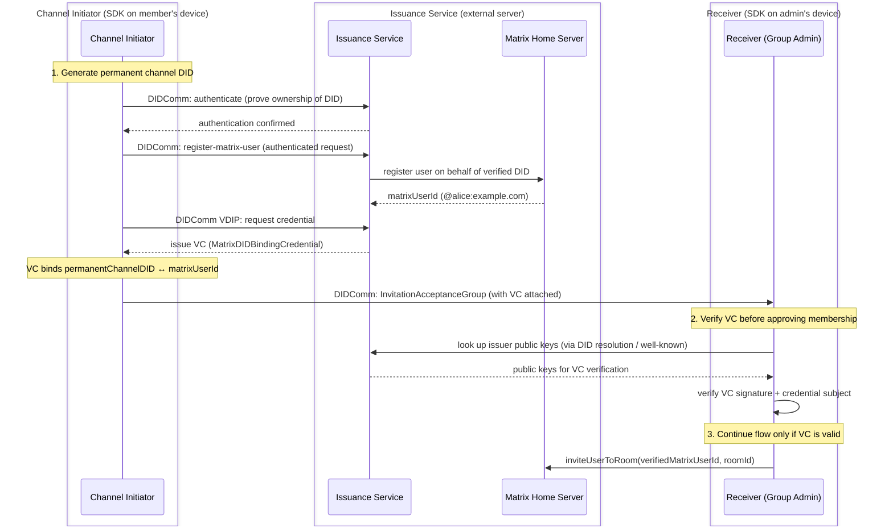

# Matrix DID Binding Architecture (Draft)

Proposed flow for binding a `permanentChannelDID` to a Matrix user ID using a trusted Issuance Service, so the receiver can cryptographically verify the binding.



## VC Structure (example)

```json
{
  "@context": ["https://www.w3.org/ns/credentials/v2"],
  "type": ["VerifiableCredential", "MatrixDIDBindingCredential"],
  "issuer": "did:web:control-plane-api.com",
  "issuanceDate": "2026-03-16T16:05:00Z",
  "credentialSubject": {
    "did": "did:key:permanent_channel_did",
    "matrix_user": "@alice:example.com"
  },
  "proof": {
    "type": "DataIntegrityProof",
    "cryptosuite": "eddsa-jcs-2022",
    "created": "2026-03-16T16:05:00Z",
    "verificationMethod": "did:web:issuer.example.com#key-1",
    "proofPurpose": "assertionMethod",
    "proofValue": "28x1ld9KpOSqWe..."
  }
}
```
