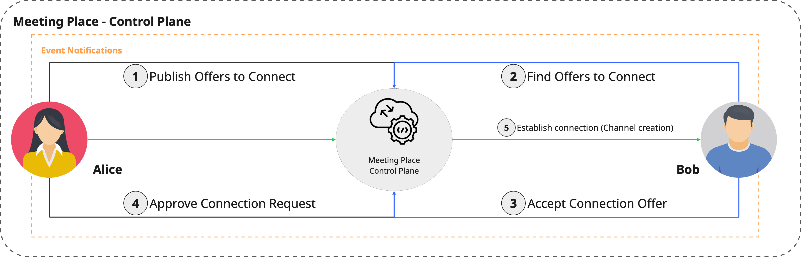

# Affinidi Meeting Place - Control Plane SDK for Dart

Affinidi Meeting Place - Control Plane SDK for Dart provides the libraries to enable the discovery between participants to establish a connection and communicate securely. It enables participants to publish a connection offer to allow other participants to communicate directly or through group chat. Through discovery, organisations and AI agents can publish their connection offers to allow users to connect and start using their services.

The Control Plane SDK is the interface that integrates with the Affinidi Meeting Place Control Plane API service to manage connection offers, channels, and event notifications.

Control Plane SDK is part of the Meeting Place SDK toolkit to enable a safe and secure method to discover, connect, and communicate between individuals, businesses, and AI agents.



> **DISCLAIMER:** Affinidi provides this SDK as a developer tool to facilitate decentralized messaging. Any personal data exchanged or stored via this tool is entirely initiated and controlled by end-users. Affinidi does not collect, access, or process such data. Implementing parties are responsible for ensuring that their applications comply with applicable privacy laws and user transparency obligations.

## Core Concepts

- **Decentralised Identifier (DID)** - A globally unique identifier that enables secure interactions. The DID is the cornerstone of Self-Sovereign Identity (SSI), a concept that aims to put individuals or entities in control of their digital identities.

- **DIDComm Message** - is a JSON Web Message (JWM), a lightweight, secure, and standardised format for structured communication using JSON. It represents headers, message types, routing metadata, and payloads designed to enable secure and interoperable communication across different systems.

- **Mediator** - A service that handles and routes messages sent between participants (e.g., users, organisations, another mediator, or even AI agents).

- **Out-Of-Band** - The protocol defined in DIDComm enables sharing a DIDComm message or invitation through a transport method other than a direct, established DIDComm channel, such as via a QR code or a URL.

- **Connection Offer (Invitation)** - An invite to connect containing description and vCard info of the publisher. Each connection offer is assigned with a unique passphrase that others can use to discover and accept the offer to connect.

## Key Features

- Support for direct and group chat connection offer.
- Implements the DIDComm Message v2.1 with Out-of-Band protocol.
- Support vCard in publishing a connection offer (invitation) and establishing connections with others to chat.
- Secure device registration and event notification.
- Facilitates the creation of channels and DIDs of the participants.

## Requirements

- Dart SDK `>=3.6.0 <4.0.0`

## Installation

Run:

```bash
dart pub add meeting_place_control_plane
```

or manually, add the package into your `pubspec.yaml` file:

```yaml
dependencies:
  meeting_place_control_plane: ^<version_number>
```

and then run the command below to install the package:

```bash
dart pub get
```

Visit the pub.dev install page of the Dart package for more information.

## Usage

```dart
import 'package:meeting_place_core/meeting_place_core.dart';
import 'package:ssi/ssi.dart'
import 'lib/discovery_sdk.dart';

void main() async {
   // Create or obtain implementations for DidManager and DidResolver
   final didManager = /* DidManager implementation */;
   final didResolver = /* DidResolver implementation */;

   // Initialize SDK
   final sdk = ControlPlaneSDK(
      didManager: didManager,
      controlPlaneDid: 'did:example:control-plane',   // your control plane DID
      mediatorDid: 'did:example:mediator',            // your mediator DID
      didResolver: didResolver,
   );

   // Set device info (must be set before commands that require a device)
   sdk.device = Device(deviceToken: 'FCM_DEVICE_TOKEN', platformType: 'android');

   try {
       // Example: execute a control-plane command.
      // Replace `SomeControlPlaneCommand` with a real command from the SDK,
      // e.g. RegisterOfferCommand, QueryOfferCommand, AcceptOfferCommand, CreateOobCommand, etc.
      final result = await sdk.execute(SomeControlPlaneCommand(/* params */));

      // Handle result
      print('Command result: $result');
   } on ControlPlaneSDKException catch (e) {
       // SDK-specific errors are wrapped in ControlPlaneSDKException
      print('Control plane SDK error: ${e.message} (code: ${e.code})');
   } catch (e) {
      print('Unexpected error: $e');
   }
}
```

For more sample usage, go to [example folder](https://github.com/affinidi/affinidi-meetingplace-sdk-dart/tree/main/packages/meeting_place_control_plane/example).

## Support & feedback

If you face any issues or have suggestions, please don't hesitate to contact us using [this link](https://share.hsforms.com/1i-4HKZRXSsmENzXtPdIG4g8oa2v).

### Reporting technical issues

If you have a technical issue with the project's codebase, you can also create an issue directly in GitHub.

1. Ensure the bug was not already reported by searching on GitHub under
   [Issues](https://github.com/affinidi/affinidi-meetingplace-sdk-dart/issues).

2. If you're unable to find an open issue addressing the problem,
   [open a new one](https://github.com/affinidi/affinidi-meetingplace-sdk-dart/issues/new).
   Be sure to include a **title and clear description**, as much relevant information as possible,
   and a **code sample** or an **executable test case** demonstrating the expected behaviour that is not occurring.

## Contributing

Want to contribute?

Head over to our [CONTRIBUTING](https://github.com/affinidi/affinidi-meetingplace-sdk-dart/blob/main/CONTRIBUTING.md) guidelines.
