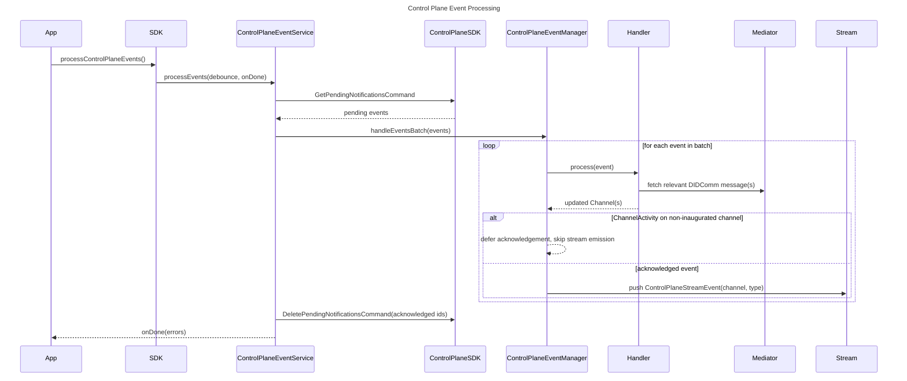

# Control Plane Event Handling Model

This document explains which control plane events exist, what each event means, and how `processControlPlaneEvents()` handles them at runtime in `meeting_place_core`, including notification retrieval, DIDComm message resolution, local state updates, and `controlPlaneEventsStream` emission.

## Scope

The control plane event is used as a signal that something happened. The data required to complete the local state transition is obtained from the corresponding DIDComm message.

In most cases, the SDK uses the event as a trigger to:

- locate the relevant local offer or channel
- fetch one or more DIDComm messages from the mediator
- update local repositories
- emit a `ControlPlaneStreamEvent` containing the updated `Channel`

## Runtime Processing Model

The main entry point is `MeetingPlaceCoreSDK.processControlPlaneEvents()`.

At a high level, processing works as follows:

## Event Types

`ControlPlaneEventType` currently defines these runtime event types:

- `InvitationAccept`
- `InvitationGroupAccept`
- `OfferFinalised`
- `GroupMembershipFinalised`
- `ChannelActivity`
- `InvitationOutreach`

## Event Catalog

| Event type | Meaning | Handler | DIDComm message fetched from mediator | Primary local side effects |
| --- | --- | --- | --- | --- |
| `InvitationAccept` | Someone accepted an individual invitation | `InvitationAcceptedEventHandler` | `InvitationAcceptance` | Creates an individual `Channel` in `waitingForApproval` |
| `InvitationGroupAccept` | Someone accepted a group invitation | `InvitationGroupAcceptedEventHandler` | `InvitationAcceptanceGroup` | Adds a pending group member and creates a pending request `Channel` |
| `OfferFinalised` | An individual connection was approved and can complete inauguration | `OfferFinalisedEventHandler` | `ConnectionRequestApproval` | Finalises the acceptor-side `ConnectionOffer`, inaugurates the acceptor-side `Channel`, sends `ChannelInauguration` |
| `GroupMembershipFinalised` | A group membership was approved by an admin | `GroupMembershipFinalisedEventHandler` | `GroupMemberInauguration` | Replaces placeholder group data, finalises the member-side `GroupConnectionOffer`, inaugurates the member-side group `Channel` |
| `ChannelActivity` | Activity occurred on an existing channel | `ChannelActivityEventHandler` | Varies by `ChannelActivity.type` | Dispatches to channel inauguration or chat activity logic |
| `InvitationOutreach` | An outreach invitation was received | `OutreachInvitationEventHandler` | `OutreachInvitation` | Looks up the referenced offer and automatically accepts it, creating a `Channel` |

## Event Stream Semantics

After each successfully handled event, the manager may push a `ControlPlaneStreamEvent` to `controlPlaneEventsStream`.

Each stream event contains:

- the original `ControlPlaneEventType`
- a `Channel` object representing the updated runtime entity associated with that event

This means stream consumers receive channel-centric updates, not the raw event payloads.

Exception for `ChannelActivity`:

- If the handler returns only channels whose `status` is not `inaugurated`, the manager does not emit a stream event.
- The event is left pending on the control plane so it can be retried once the channel becomes inaugurated.

## Event Details

### InvitationAccept

Meaning:

- Another party accepted an individual invitation.
- The event is processed on the invitation owner's device.

Handler behavior:

The handler resolves the local invitation, fetches `InvitationAcceptance` from the mediator, creates a new individual `Channel` in `waitingForApproval`, and emits that channel through the stream.

What the event means in practice:

- A pending connection request now exists locally.
- The invitation owner can approve or reject it.

### InvitationGroupAccept

Meaning:

- Another party accepted a group invitation.
- The event is processed on the group admin's device.

Handler behavior:

The handler fetches `InvitationAcceptanceGroup`, adds the joining party to `Group.members` as `pendingApproval`, persists a new pending group-request `Channel`, and emits the existing main group channel.

What the event means in practice:

- A join request is now pending in the admin's local group state.
- The admin can approve or reject it.

Important nuance:

- The handler persists a new pending-request channel, but returns the existing main group channel to the event stream.

### OfferFinalised

Meaning:

- An individual invitation has been approved by the invitation owner.
- The event is processed on the accepting party's device.

Handler behavior:

The handler fetches `ConnectionRequestApproval`, registers notification state, updates mediator ACLs, sends `ChannelInauguration`, marks the local offer and channel finalised or inaugurated, and notifies the other side via `NotifyChannelCommand`.

What the event means in practice:

- The acceptor has enough information to complete the pairwise DIDComm channel setup.

### GroupMembershipFinalised

Meaning:

- A group admin approved the joining member.
- The event is processed on the joining member's device.

Handler behavior:

The handler fetches `GroupMemberInauguration`, checks that it targets the expected member DID, replaces placeholder group data with authoritative group metadata, updates ACL and notification state, and marks the local group offer and channel finalised or inaugurated.

What the event means in practice:

- The member-side group relationship is fully materialised locally.
- Placeholder group values are replaced with authoritative group metadata from DIDComm.

### ChannelActivity

Meaning:

- Activity occurred on an existing channel.
- The actual runtime behavior depends on the `ChannelActivity.type` string.

Dispatch behavior:

| `ChannelActivity.type` | Handler path | Meaning in practice |
| --- | --- | --- |
| `channel-inauguration` | `ChannelInaugurationEventHandler` | The other party completed the last step of pairwise channel inauguration |
| `chat-activity` | `ChatActivityEventHandler` | The SDK updates sequence-tracking state for the channel |
| any other value | warning + no-op | Unsupported activity subtype |

#### `channel-inauguration`

Behavior:

The handler fetches `ChannelInauguration` for the referenced channel, marks the initiator-side channel as inaugurated, stores the other party notification token, and emits the updated channel.

What it means in practice:

- The invitation owner's side has now completed pairwise channel setup.

#### `chat-activity`

Behavior:

The handler fetches mediator messages relevant for sequence tracking, updates `channel.seqNo` and `channel.messageSyncMarker`, and returns the updated channel.

What it means in practice:

- The SDK updates channel-level sync state and unread progression metadata.
- This handler is about channel bookkeeping, not about rendering message content.

Important nuance:

- Within a single pending-notification batch, only the first `ChannelActivity` for a given `did` and `type` pair is processed. Later duplicates in the same batch are skipped.
- If the channel is not yet `inaugurated`, the handler still runs and local sync metadata is updated, but the manager defers acknowledgement and does not emit a stream event. The pending notification remains on the control plane until the channel becomes inaugurated.

### InvitationOutreach

Meaning:

- An outreach invitation was received for an outreach offer.

Handler behavior:

The handler fetches `OutreachInvitation`, resolves the referenced offer from the embedded mnemonic, accepts that offer automatically, and emits the newly created channel.

What the event means in practice:

- The SDK automatically follows the outreach link to the referenced offer and accepts it.

## Processing Guarantees And Caveats

### Batch order

- Events are processed sequentially in the order returned by `GetPendingNotificationsCommand`.
- For each successfully handled event, one or more updated channels may be returned.
- A separate `ControlPlaneStreamEvent` is emitted for each returned channel.
- For `ChannelActivity`, stream emission is skipped when the returned channel is not yet `inaugurated`.

### Acknowledgement and pending-notification deletion

`ControlPlaneEventManager.handleEventsBatch(...)` returns the subset of events that should be deleted from the control plane.

Internally, the manager tracks two lists:

- `processedEventsForDedup`: every event handled in the current batch, used to skip duplicate `ChannelActivity` entries within the batch
- `acknowledgedEvents`: events whose pending notifications should be deleted

For most event types, a successfully handled event is always acknowledged.

For `ChannelActivity`, acknowledgement is deferred when the handler returns one or more channels and every returned channel has a status other than `inaugurated`. In that case:

- local handler side effects still run
- no `ControlPlaneStreamEvent` is emitted
- the event is not included in the returned acknowledged list
- `ControlPlaneEventService` therefore leaves the pending notification on the control plane

Once the channel becomes `inaugurated`, a later poll can process the same pending notification again, acknowledge it, and emit the stream event.

`ChannelActivity` events that return no channels, such as duplicates skipped within the batch, are still acknowledged.

### Mediator message handling

- Most handlers use the base event handler flow:
  - fetch messages from the mediator
  - process each DIDComm message
  - delete processed mediator messages
- If no matching mediator message is found after retries, the handler returns no channels.

### Error handling

- Exceptions are caught in `ControlPlaneEventManager.handleEventsBatch(...)`.
- Errors are forwarded to the stream manager with `addError(...)`.
- Collected errors are also provided to the `onDone` callback of `processControlPlaneEvents(...)`.

Important caveat:

- Even when a handler throws, the event is still added to the acknowledged-events list in the manager.
- The event service therefore deletes the corresponding pending notification from the control plane.

In other words, a failed event is surfaced as an error, but it is not left pending for automatic retry by the control plane event queue.

This error-handling behavior is unchanged by inauguration deferral. Deferred `ChannelActivity` events are not failures; they remain pending intentionally until the channel is inaugurated.

### Debouncing and queueing

- Control plane event processing is debounced
- Multiple calls during an active processing window are queued.
- Once processing completes, queued requests continue until the queue is empty.
