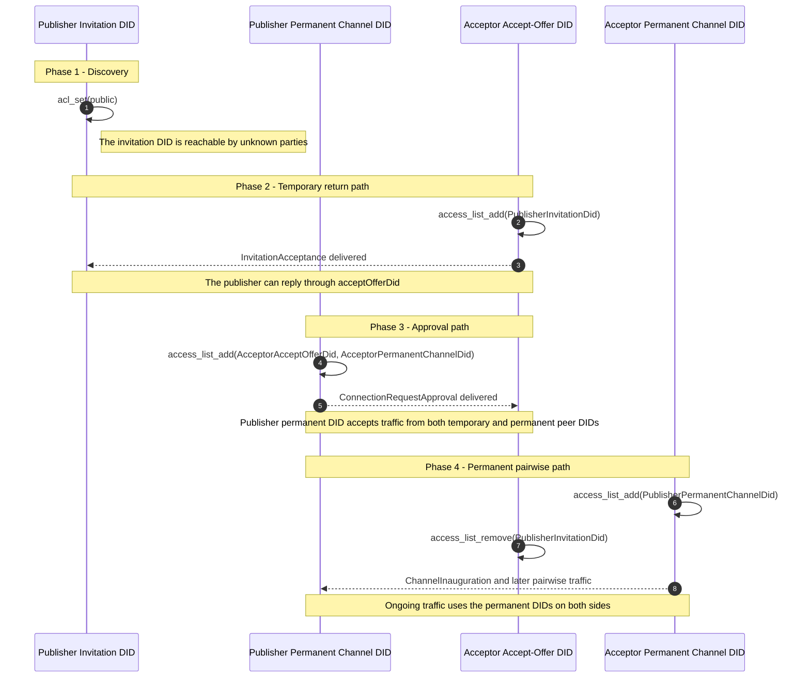
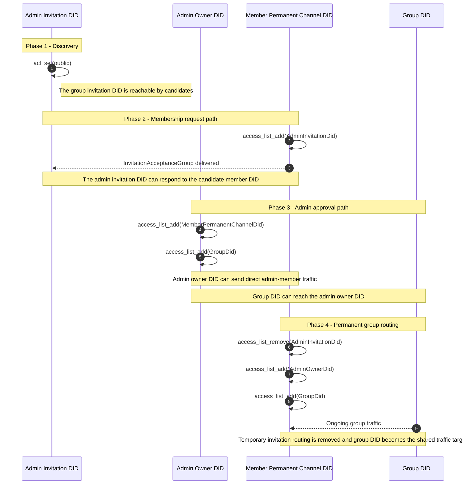

# Mediator ACL And Routing Model

This document explains how `meeting_place_core` uses mediator ACLs and DID-based routing to make offers discoverable, deliver handshake messages, establish steady-state channels, and revoke access when a relationship ends.

## Why This Matters

The mediator model has two separate concerns:

- ACLs decide which DIDs are allowed to send messages to another DID through the mediator.
- Routing decides which DID document the SDK encrypts for and which DID is used as the next mediator hop.

Those concerns evolve across the handshake.

- Discovery uses dedicated OOB DIDs with public ACLs.
- Approval flows temporarily grant access to invitation or acceptance DIDs.
- Steady-state messaging uses permanent channel DIDs for individual channels and the group DID for group traffic.
- Cleanup removes grants that are no longer needed.

## Mental Model

The current implementation treats the mediator as a set of DID-scoped recipient identities.

- Every ACL entry is defined for an owner DID.
- The mediator ACL for that owner DID determines who may send to that DID through the mediator.
- Local entities such as `Channel`, `ConnectionOffer`, and `Group` store enough DID data to decide which recipient DID should receive the next message.
- The selected `mediatorDid` determines which mediator instance is used for the operation.

In other words, the SDK does not maintain one global conversation ACL. It updates DID-specific permissions incrementally as the relevant DIDs become known.

## ACL Primitives Used By The SDK

The mediator package exposes three ACL payload types that matter here:

| ACL payload | Meaning | How `meeting_place_core` uses it |
| --- | --- | --- |
| `AclSet.toPublic(ownerDid: ...)` | Replaces the ACL for the owner DID with a public ACL flag | Makes OOB invitation DIDs discoverable to unknown parties |
| `AccessListAdd(ownerDid: ..., granteeDids: [...])` | Grants one or more specific DIDs permission to send to the owner DID | Opens temporary or permanent communication paths during handshake and steady-state messaging |
| `AccessListRemove(ownerDid: ..., granteeDids: [...])` | Revokes previously granted permission | Removes temporary handshake access or tears down channel access |

The mediator hashes DIDs before sending the ACL payload, but the Core SDK reasons about the clear-text DID roles.

## DID Roles In Routing

These DIDs play distinct roles in the routing model:

| DID | Role in the runtime model |
| --- | --- |
| `mediatorDid` | Selects the mediator instance used for authentication, ACL updates, send, fetch, and subscribe operations |
| OOB invitation DID (`publishOfferDid` for offers) | Public discovery DID and first inbound handshake recipient DID |
| `acceptOfferDid` | Temporary recipient DID used to receive the approval message after the accepter responds to an offer |
| `permanentChannelDid` | Steady-state local DID for direct pairwise traffic or member-specific traffic |
| `otherPartyPermanentChannelDid` | The peer's steady-state recipient DID for individual channels, or the group DID for group channels |
| `group.did` | Shared group recipient DID used for group traffic after membership is approved |
| `controlPlaneDid` | Service DID allowed to send DIDComm notifications to registered notification recipient DIDs |

For most runtime operations, the locally persisted `Channel` is the practical source of routing information because it stores `mediatorDid`, `permanentChannelDid`, and `otherPartyPermanentChannelDid` together.

## Routing Rules Used By The SDK

At send time, the SDK combines three inputs:

- the `mediatorDid` stored on the current entity or passed explicitly
- the resolved DID document of the intended recipient
- an optional `next` hop override when the first delivery target is not the same DID as the long-term peer identity

At the mediator SDK layer:

- `recipientDidDocument` provides encryption keys, service endpoints, and routing metadata
- `next` defaults to `recipientDidDocument.id`
- handshake flows override `next` when the first mediator recipient is a temporary DID rather than the long-term peer DID

## Individual Connection Flow

### 1. Offer publication opens a public discovery DID

When `publishOffer(...)` creates an offer, the SDK generates a fresh OOB DID and immediately sets the ACL for that DID to public.

- owner DID: the OOB invitation DID
- ACL update: `AclSet.toPublic(ownerDid: oobDid)`
- purpose: allow unknown parties to deliver the first `InvitationAcceptance`

### 2. Acceptance opens a temporary return path

When another party accepts the invitation, the accepter creates:

- an `acceptOfferDid` for the approval reply
- a `permanentChannelDid` for the final pairwise channel

Before sending `InvitationAcceptance`, the accepter grants the publisher's OOB DID permission to send to the temporary acceptance DID.

- owner DID: `acceptOfferDid`
- ACL update: `AccessListAdd(ownerDid: acceptOfferDid, granteeDids: [publishOfferDid])`
- routing target: publisher OOB DID
- `next`: publisher OOB DID

### 3. Approval opens the publisher's steady-state DID

When the publisher approves the request, the SDK creates or uses the publisher-side `permanentChannelDid` and grants two senders permission to reach it.

- owner DID: publisher `permanentChannelDid`
- ACL update: `AccessListAdd(ownerDid: publisherPermanentDid, granteeDids: [otherPartyPermanentChannelDid, otherPartyAcceptOfferDid])`

Both grants are needed at this stage:

- the peer's `acceptOfferDid` is still used to receive `ConnectionRequestApproval`
- the peer's `permanentChannelDid` will be used immediately after finalisation and inauguration

The approval message is then routed to the accepter's temporary DID.

- recipient DID document: `acceptOfferDid`
- `next`: `acceptOfferDid`

### 4. Finalisation migrates access from temporary to permanent DIDs

When the accepter processes `ConnectionRequestApproval`, the SDK completes two ACL changes in parallel.

- owner DID: accepter `permanentChannelDid`
- ACL update: `AccessListAdd(ownerDid: accepterPermanentDid, granteeDids: [publisherPermanentDid])`
- owner DID: `acceptOfferDid`
- ACL update: `AccessListRemove(ownerDid: acceptOfferDid, granteeDids: [publisherOobDid])`

This is the key ACL transition in the individual handshake:

- the temporary acceptance DID stops being the ongoing ingress DID
- the permanent pairwise DIDs become the long-term sender and recipient identities

The accepter then sends `ChannelInauguration` directly to the publisher's permanent DID.

### 5. Steady-state individual messaging uses permanent channel DIDs

Once the channel is inaugurated, regular individual messages use the direct message path.

- sender DID: local `permanentChannelDid`
- recipient DID: peer `otherPartyPermanentChannelDid`
- recipient DID document: resolved from the peer permanent DID
- `next`: defaults to the peer permanent DID

The SDK does not keep using `publishOfferDid` or `acceptOfferDid` for normal pairwise traffic after inauguration.

### Individual ACL Evolution

## Group Membership Flow

### 1. Group offer publication also uses a public OOB DID

Group offer creation follows the same discovery pattern as individual offers.

- owner DID: group offer OOB DID
- ACL update: `AclSet.toPublic(ownerDid: oobDid)`

The admin's long-lived group owner DID and eventual group DID are separate from this public discovery DID.

### 2. Membership acceptance grants the admin access to the member's DID

When a candidate member accepts a group offer, the SDK creates a member `permanentChannelDid` and grants the admin's invitation DID access to it before sending `InvitationAcceptanceGroup`.

- owner DID: member `permanentChannelDid`
- ACL update: `AccessListAdd(ownerDid: memberPermanentDid, granteeDids: [adminInvitationDid])`
- recipient DID document: admin invitation DID
- `next`: admin invitation DID

### 3. Admin approval opens both admin and group-level routes

When the admin approves membership, the SDK updates ACLs so that the new member can interact with both the admin and the eventual group recipient DID.

On the admin side:

- the group owner DID grants the member DID permission for direct admin-member traffic
- the group owner DID also grants the group DID permission to send to the owner DID

The member then receives `GroupMemberInauguration`, which contains the authoritative group DID and membership state.

### 4. Member finalisation replaces temporary access with group routing

When the joining member processes `GroupMemberInauguration`, the SDK performs three ACL updates.

- owner DID: member `permanentChannelDid`
- ACL update: `AccessListRemove(ownerDid: memberPermanentDid, granteeDids: [adminInvitationDid])`
- owner DID: member `permanentChannelDid`
- ACL update: `AccessListAdd(ownerDid: memberPermanentDid, granteeDids: [adminDid])`
- owner DID: member `permanentChannelDid`
- ACL update: `AccessListAdd(ownerDid: memberPermanentDid, granteeDids: [groupDid])`

After that transition:

- direct admin-to-member profile or management messages can use the admin DID
- group messages are addressed to the shared `groupDid`
- the temporary invitation DID is no longer part of the routing path

### 5. Steady-state group messaging targets the group DID

Group messages are not sent through the same direct pairwise path as individual messages.

- the sender still uses a local member DID
- the runtime channel for the group stores `otherPartyPermanentChannelDid = groupDid`
- the SDK encrypts the payload with the group's public key
- the send path goes through `GroupSendMessageCommand`, which uses the group DID as the recipient identity

That means the group DID acts as the shared routing target for ongoing group traffic, even though each member still owns an individual permanent DID for direct management traffic and notification setup.

### Group ACL Evolution

## DIDComm Notification Registration

`registerForDIDCommNotifications(...)` adds another DID-based ingress pattern that is separate from connection handshakes.

The SDK:

- creates or reuses a recipient DID
- registers a control-plane device token in the form `mediatorDid::recipientDid`
- grants `controlPlaneDid` permission to send to that DID

This allows the control plane service to deliver DIDComm notification traffic to a DID-backed recipient DID that can later be fetched from or subscribed to on the mediator.

## Cleanup And Revocation

The runtime also removes ACL entries when a relationship ends.

- `unlink(...)` removes the peer permanent DID from the ACL of the local permanent channel DID for individual channels
- `leaveGroup(...)` removes the group DID from the ACL of the member DID
- individual and group finalisation remove temporary invitation-path grants once permanent routing is established

The implementation therefore treats ACL updates as part of the lifecycle, not as one-time setup.

## Practical Source Of Truth For Consumers

The following rules are the practical source of truth for reasoning about mediator routing from persisted local state:

- `Channel.mediatorDid` identifies which mediator instance the channel uses
- `Channel.permanentChannelDid` is the local steady-state sender DID for the relationship
- `Channel.otherPartyPermanentChannelDid` is the steady-state recipient DID for individual channels, or the `groupDid` for group channels
- `acceptOfferDid` and OOB invitation DIDs are handshake-only routing identifiers and should usually not be treated as long-term recipients

In practice, the ACL state itself is not mirrored into a dedicated local entity. It is inferred from the handshake phase and the DID roles stored on `ConnectionOffer`, `Channel`, and `Group`.

## Caveats

- This document describes the current SDK implementation, not an idealized mediator policy model.
- Group traffic uses a control-plane-backed send path for encrypted group payloads, so the routing path is not identical to direct pairwise messaging.
- ACL updates are targeted to the relevant owner DID; there is no single global grant for an entire connection or group.
- Because ACLs are updated incrementally, partial handshake state can temporarily expose both a temporary DID and a permanent DID as valid ingress paths until the final cleanup step runs.
