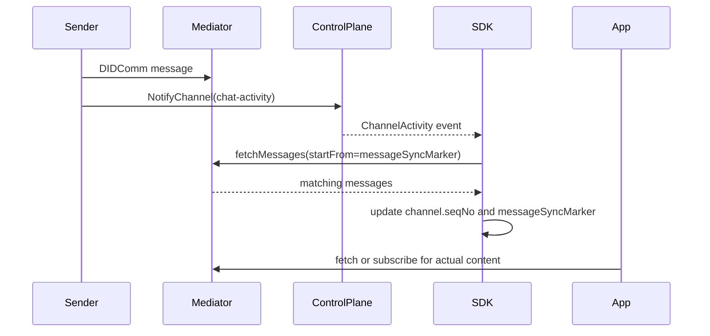

# Notification And Sync Model

This document explains how `meeting_place_core` uses control-plane notifications, DIDComm notification registration, and channel sync markers at runtime.

The important design point is that notifications are signals, not the source of truth for message content.

- the control plane tells the device or channel that something happened
- the mediator remains the source of DIDComm payloads
- local `Channel` state stores the bookkeeping needed to catch up

## Why This Matters

There are two different notification layers in the SDK:

- device registration on the control plane
- per-channel notification tokens used to signal channel activity

There are also two different message-consumption paths:

- control-plane event processing, which advances local runtime state
- direct mediator fetch or subscribe calls, which return the actual DIDComm messages

If those layers are conflated, it is easy to misread what the SDK persists and what the application still needs to fetch.

## Mental Model

The runtime model is best understood as a pipeline:

1. the app registers a delivery target with the control plane
2. the control plane emits lightweight events such as `OfferFinalised`, `GroupMembershipFinalised`, or `ChannelActivity`
3. the SDK fetches the corresponding DIDComm payloads from the mediator
4. the SDK updates local `Channel`, `ConnectionOffer`, and `Group` records
5. the app fetches or subscribes to mediator messages when it needs the actual content

In other words, notifications move the workflow forward, while mediator fetches reveal the data.

## Notification Layers

### 1. Push Device Registration

`registerForPushNotifications(deviceToken)` registers the current device token with the control plane as a push-notification device.

What this registration does:

- associates the current SDK instance with a device token
- allows the control plane to notify the device about Meeting Place events

### 2. DIDComm Device Registration

`registerForDIDCommNotifications(...)` registers a DID-backed recipient for notification delivery through the mediator.

The SDK:

- creates or reuses a recipient DID
- builds a device token in the form `mediatorDid::recipientDid`
- registers that token on the control plane as a DIDComm device
- updates mediator ACLs so `controlPlaneDid` may send to that recipient DID
- assigns the resulting `Device` to `ControlPlaneSDK.device`

This is a different ingress mechanism from push notifications.

It allows the control plane to place DIDComm notification traffic onto a mediator-backed DID that the app can later fetch from or subscribe to.

### 3. Per-Channel Notification Registration

Device registration alone is not enough for channel lifecycle notifications.

Once the SDK knows both sides of a relationship, it calls `RegisterNotificationCommand(myDid, theirDid, device)` to register a per-channel notification token.

This happens during finalisation:

- individual acceptor side: `OfferFinalisedEventHandler`
- joining group member side: `GroupMembershipFinalisedEventHandler`

The returned token is persisted as the local side's `notificationToken`.

The remote side's token arrives through protocol data and is persisted as `otherPartyNotificationToken`:

- for individual channels, the acceptor receives the publisher token from the `OfferFinalised` event and the publisher later receives the acceptor token from `ChannelInauguration`
- for group channels, the member stores its own token during membership finalisation; there is no symmetric peer token exchange like the pairwise flow

## Where Notification Tokens Live

The current implementation copies notification state onto persisted domain records:

- `ConnectionOffer.notificationToken`
- `ConnectionOffer.otherPartyNotificationToken`
- `Channel.notificationToken`
- `Channel.otherPartyNotificationToken`

For steady-state messaging, the practical source of truth is usually the `Channel` record.

## Signal Types In Practice

The notification model produces two broad kinds of signals.

### Lifecycle Signals

These come through control-plane events such as:

- `InvitationAccept`
- `InvitationGroupAccept`
- `OfferFinalised`
- `GroupMembershipFinalised`
- `InvitationOutreach`

Their purpose is to tell the SDK to fetch mediator messages and advance local state.

### Channel Activity Signals

The implementation currently recognizes these channel activity subtypes:

- `channel-inauguration`
- `chat-activity`

`channel-inauguration` completes the final pairwise handshake step for the connection initiator.

`chat-activity` updates per-channel sync bookkeeping so the app can later fetch the relevant mediator messages.

## Sync State Stored On Channel

The SDK stores two pieces of sync bookkeeping on `Channel`:

| Field | Meaning in practice |
| --- | --- |
| `seqNo` | Highest message sequence number the SDK has observed for the channel |
| `messageSyncMarker` | Latest message creation timestamp the SDK has observed for the channel |

These fields are not the messages themselves.

They are cursors that help the SDK and the app decide where the next mediator fetch should start.

## How `chat-activity` Sync Works

When the control plane emits `ChannelActivity(type = chat-activity)`, `ChatActivityEventHandler` looks up the local `Channel`, fetches matching mediator messages starting from `channel.messageSyncMarker`, and updates the channel's `seqNo` and `messageSyncMarker` from the fetched results without deleting those messages. This handler updates channel sync metadata, not message content.

The actual application-facing message fetch still happens through:

- `fetchMessages(...)`
- `subscribeToMediator(...)`
- higher-level SDK layers such as the chat package

## Relationship Between Notifications And Mediator Fetches

The runtime behavior is intentionally indirect.

### Pairwise channel example

### What The event means

- it tells the SDK there may be new mediator content relevant to the channel
- it does not carry the message body itself
- it does not guarantee that the app has already consumed the message

## Control Plane Event Stream Semantics

After a control-plane event is processed successfully, the SDK emits a `ControlPlaneStreamEvent` containing the updated `Channel`.

For sync-related workflows, that means stream consumers receive a channel whose bookkeeping may have changed:

- status may advance to `inaugurated`
- notification token fields may become available
- `seqNo` and `messageSyncMarker` may advance

The stream is therefore channel-centric state output, not a message-content stream.

## Cleanup Behavior

When a relationship ends, the SDK deregisters the local per-channel notification token if one exists.

This happens in:

- `ConnectionService.unlink(...)` for individual channels
- `GroupService.leaveGroup(...)` for group channels

That cleanup removes the channel-specific notification registration, but it does not automatically undo the higher-level device registration created by `registerForPushNotifications(...)` or `registerForDIDCommNotifications(...)`.

## Practical Source Of Truth For Consumers

If the app needs to reason about notification and sync state, these are the practical rules:

- `ControlPlaneSDK.device` is the currently registered delivery target used for new notification registrations
- `Channel.notificationToken` is the local token for this relationship
- `Channel.otherPartyNotificationToken` is the token used to notify the other side when the flow supports it
- `Channel.seqNo` and `Channel.messageSyncMarker` are bookkeeping cursors, not message storage
- mediator fetch or subscribe APIs are still required to obtain the actual DIDComm content
