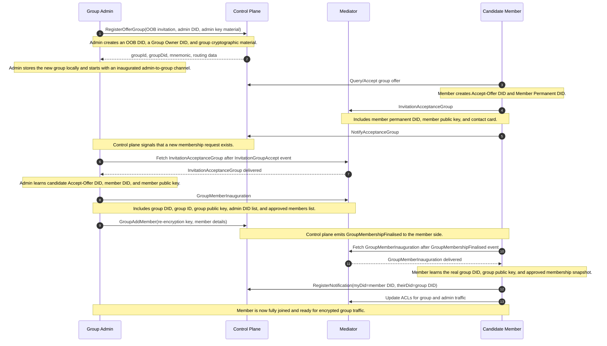
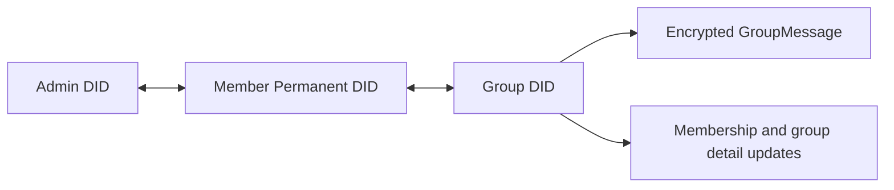

# Meeting Place Group DIDComm Connection Protocol

The group protocol uses the same two layers as individual connections:

- The control plane handles group offer discovery, membership lifecycle events, and coordination data.
- The mediator transports the DIDComm messages exchanged between the admin and the joining member.

## Table of Contents

- [End-to-End Sequence](#end-to-end-sequence)
- [Handshake Phases](#handshake-phases)
    - [1. Group Creation and Offer Publication](#1-group-creation-and-offer-publication)
    - [2. Candidate Member Accepts the Group Offer](#2-candidate-member-accepts-the-group-offer)
    - [3. Admin Reviews and Approves Membership](#3-admin-reviews-and-approves-membership)
    - [4. Member Finalises Group Membership](#4-member-finalises-group-membership)
- [DID Usage for Group Setup](#did-usage-for-group-setup)
    - [DID Roles](#did-roles)
    - [DID Lifecycle](#did-lifecycle)
- [Lifecycle View](#lifecycle-view)
- [Message Reference](#message-reference)
- [After Membership Finalisation](#after-membership-finalisation)
- [Group-Specific Design Notes](#group-specific-design-notes)
- [Implementation Notes](#implementation-notes)

## End-to-End Sequence



## Handshake Phases

### 1. Group Creation and Offer Publication

The group admin creates the group before any other member joins. This includes:

- a fresh OOB DID for the invitation
- a group owner DID for administration
- group cryptographic material
- a group offer registered through the control plane
- the admin OOB DID is set to public in the mediator ACL so candidates can send the first DIDComm membership request

Example OOB DIDComm invitation payload:

```jsonc
{
    "id": "7d3c52f0-group-oob-invitation-id",
    "type": "https://didcomm.org/out-of-band/2.0/invitation",
    "from": "did:key:group-admin-oob-did",
    "body": {
        "goal_code": "connect",
        "goal": "Start relationship",
        "accept": ["didcomm/v2"]
    }
}
```

The control plane returns a real `groupId` and `groupDid`, and the SDK stores a local group record with the admin already marked as an approved member.

At this point, the admin already has an inaugurated admin-to-group channel locally. New members join later through the invitation flow.

### 2. Candidate Member Accepts the Group Offer

The candidate member discovers the group offer and creates two DIDs:

- Accept-Offer DID for the join request
- Member Permanent DID for ongoing participation in the group

The candidate also creates member key material and sends `InvitationAcceptanceGroup` through the mediator.

Example `InvitationAcceptanceGroup` payload:

```jsonc
{
    "id": "1d7c6e7b-group-acceptance-id",
    "type": "https://affinidi.com/didcomm/protocols/meeting-place-core/1.0/invitation-acceptance-group",
    "from": "did:key:candidate-accept-offer-did",
    "to": ["did:key:group-admin-oob-did"],
    "parentThreadId": "group-invitation-id",
    "body": {
        "channel_did": "did:key:candidate-member-permanent-did",
        "public_key": "<candidate-member-public-key-base64>"
    },
    "attachments": [
        {
            "id": "contact-card-attachment-id",
            "format": "contactCard",
            "media_type": "text/x-vcard",
            "description": "Contact card info",
            "data": {
                "base64": "<contact-card-base64>"
            }
        }
    ]
}
```

The candidate then notifies the control plane with `NotifyAcceptanceGroup`, which causes the admin side to process the request.

### 3. Admin Reviews and Approves Membership

After receiving the `InvitationGroupAccept` event, the admin fetches `InvitationAcceptanceGroup` from the mediator and adds the candidate to the local group as a pending member.

If the admin approves the request, it:

- resolves the candidate member DID
- allows the candidate to message the group admin where needed
- generates the re-encryption material required for group messaging
- sends `GroupMemberInauguration` to the candidate member DID
- finalises the membership in the control plane with `GroupAddMember`

Example `GroupMemberInauguration` payload:

```jsonc
{
    "id": "9a3f2c11-group-inauguration-id",
    "type": "https://affinidi.com/didcomm/protocols/meeting-place-core/1.0/group-member-inauguration",
    "from": "did:key:group-admin-owner-did",
    "to": ["did:key:candidate-member-permanent-did"],
    "body": {
        "member_did": "did:key:candidate-member-permanent-did",
        "group_did": "did:key:group-did",
        "group_id": "group-id",
        "group_public_key": "<group-public-key-base64>",
        "admin_dids": ["did:key:group-admin-owner-did"],
        "members": [
            {
                "did": "did:key:group-admin-owner-did",
                "contactCard": {
                    "did": "did:key:group-admin-owner-did",
                    "type": "person",
                    "contactInfo": {"displayName": "Group Admin"}
                },
                "membershipType": "admin",
                "status": "approved",
                "publicKey": "<admin-public-key-base64>"
            },
            {
                "did": "did:key:candidate-member-permanent-did",
                "contactCard": {
                    "did": "did:key:candidate-member-permanent-did",
                    "type": "person",
                    "contactInfo": {"displayName": "Candidate Member"}
                },
                "membershipType": "member",
                "status": "approved",
                "publicKey": "<candidate-member-public-key-base64>"
            }
        ]
    }
}
```

This is the main protocol difference from individual connections: the approval message does not establish a peer channel between two people. It hands the new member the information required to participate in the group itself.

### 4. Member Finalises Group Membership

The candidate member receives a `GroupMembershipFinalised` control-plane event and then fetches the `GroupMemberInauguration` DIDComm message from the mediator.

The member then:

- verifies that the inauguration message is for its permanent member DID
- registers notification state for `memberDid -> groupDid`
- updates mediator ACLs
- replaces the placeholder local group with the real group metadata
- marks the local connection offer as finalised
- marks the local channel as inaugurated

After this step, the member no longer behaves like a pending invitee. It is a full group participant.

## DID Usage for Group Setup

### DID Roles

The group join flow uses several identities with distinct roles:

- Admin OOB DID: used by the group admin to publish the invitation and receive the first membership request.
- Group owner DID: the admin's long-lived DID for administering the group.
- Group DID: the DID representing the group itself for message delivery.
- Accept-offer DID: temporary DID created by a joining member for the acceptance step.
- Member permanent DID: the joining member's long-lived DID used after membership is finalised.

Unlike an individual connection, the steady-state relationship is not member-to-admin. It is member-to-group.

### DID Lifecycle

```text
Admin OOB DID
    create  -> publish invitation -> receive InvitationAcceptanceGroup -> handoff complete
---
Group owner DID
    create  -> create group -> administer membership -> continue as admin DID
---
Group DID
    create  -> receive member traffic after finalisation -> continue as group messaging DID
---
Candidate Accept-Offer DID
    create  -> send InvitationAcceptanceGroup -> membership approved -> no longer primary DID
---
Candidate Member Permanent DID
    create  -> join request references it -> receive GroupMemberInauguration -> continue as private member DID
```

The lifecycle is intentionally staged:

- the Admin OOB DID is scoped to invitation publication and the first inbound membership request
- the Group owner DID remains the admin's long-lived management DID
- the Group DID becomes the steady-state DID for encrypted group communication
- the Candidate Accept-Offer DID is scoped to the temporary membership approval handshake
- the Candidate Member Permanent DID becomes the long-lived private member DID after finalisation

## Lifecycle View

```text
                  Group invite published
                           |
                           v
             +---------------------------+
             |         Published         |
             +---------------------------+
                           |
                           | Candidate sends InvitationAcceptanceGroup
                           v
             +---------------------------+
             |       PendingMember       |
             +---------------------------+
                           |
                           | Admin approves member
                           v
             +---------------------------+
             |      ApprovedByAdmin      |
             +---------------------------+
                           |
                           | Candidate processes GroupMemberInauguration
                           v
             +---------------------------+
             |      FinalisedMember      |
             +---------------------------+
```

The membership lifecycle is best understood as:

- `Published`: the group invite exists and is discoverable
- `PendingMember`: the candidate has requested membership and is awaiting admin approval
- `ApprovedByAdmin`: the admin has approved and sent group membership data
- `FinalisedMember`: the candidate has processed inauguration and joined the group

For local channel state, the joining member follows the familiar transition from `waitingForApproval` to `inaugurated`, while the group admin already operates on an inaugurated group channel from group creation.

## Message Reference

| Stage | Protocol message | Purpose |
| --- | --- | --- |
| Discovery | Out-of-band invitation | Advertises a joinable group and mediator routing context |
| Join request | `InvitationAcceptanceGroup` | Candidate requests membership and shares member DID and member public key |
| Approval | `GroupMemberInauguration` | Admin shares group DID, group public key, admin list, and approved members |
| Steady state | `GroupMessage` | Sends encrypted group traffic addressed to the group DID |

## After Membership Finalisation



Once membership is finalised, the main communication path becomes:

- member DID to group DID for normal group traffic
- admin DID to member DID for certain direct administrative interactions such as profile-related requests

Group traffic uses `GroupMessage`, which carries encrypted group payload data and sequence information rather than plain peer-to-peer chat content.

## Group-Specific Design Notes

The group protocol adds cryptographic membership data on top of the basic invitation workflow.

- The candidate member contributes a member public key when requesting access.
- The admin finalises membership with group-level public data and re-encryption setup.
- The member receives a full group membership snapshot during inauguration.

This is why the group flow is structurally different from the individual flow even though both start with an invitation and use the same control-plane-plus-mediator architecture.

## Implementation Notes

The implementation of this flow is split across the SDK layers:

- Core SDK: group creation, membership workflow, local group state, and event handling
- Control Plane SDK: group offer registration, membership acceptance/finalisation, and membership lifecycle events
- Mediator SDK: DIDComm message delivery and ACL updates

For groups, the important distinction is:

- the control plane signals that membership state changed
- the mediator carries the actual DIDComm payload that gives the member the group data needed to participate
