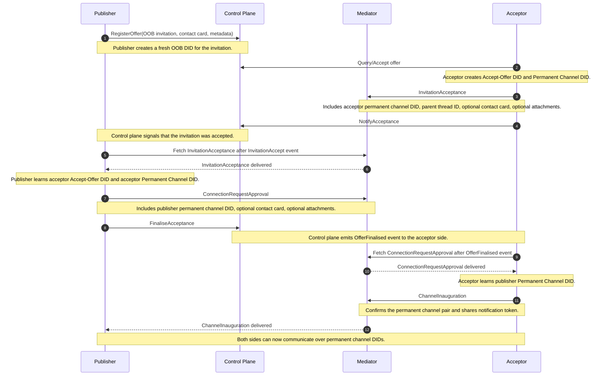

# Meeting Place DIDComm Connection Protocol

The protocol uses two layers:

- The control plane handles discovery, offer registration, acceptance, finalisation, and notification-style lifecycle events.
- The mediator transports the actual DIDComm messages exchanged between participants.

## Table of Contents

- [End-to-End Sequence](#end-to-end-sequence)
- [Handshake Phases](#handshake-phases)
    - [1. Offer Publication](#1-offer-publication)
    - [2. Invitation Acceptance](#2-invitation-acceptance)
    - [3. Publisher Review and Approval](#3-publisher-review-and-approval)
    - [4. Channel Inauguration](#4-channel-inauguration)
- [DID Usage for Connection Setup](#did-usage-for-connection-setup)
    - [DID Roles](#did-roles)
    - [DID Lifecycle](#did-lifecycle)
- [Channel Lifecycle](#channel-lifecycle)
- [Message Reference](#message-reference)
- [Implementation Notes](#implementation-notes)

## End-to-End Sequence



## Handshake Phases

### 1. Offer Publication

The publisher creates a new OOB DID and registers a connection offer through the control plane. The offer contains:

- offer metadata such as name, description, validity, and usage limits
- a contact card for discovery context
- an out-of-band DIDComm invitation whose goal is to establish a relationship
- the mediator DID used for subsequent message routing
- the publisher OOB DID is set to public in the mediator ACL so invitation recipients can send the first DIDComm acceptance message

Example OOB DIDComm invitation payload:

```jsonc
{
    "id": "7d3c52f0-oob-invitation-id",
    "type": "https://didcomm.org/out-of-band/2.0/invitation",
    "from": "did:key:publisher-oob-did",
    "body": {
        "goal_code": "connect",
        "goal": "Start relationship",
        "accept": ["didcomm/v2"]
    }
}
```


At this stage, the offer is discoverable but no channel exists yet.

### 2. Invitation Acceptance

The acceptor discovers the offer, creates two DIDs, and sends the first DIDComm handshake message:

- Accept-Offer DID for the acceptance step
- Permanent Channel DID for future messaging

Example `InvitationAcceptance` payload:

```jsonc
{
    "id": "1d7c6e7b-acceptance-id",
    "type": "https://affinidi.com/didcomm/protocols/meeting-place-core/1.0/invitation-acceptance",
    "from": "did:key:accept-offer-did",
    "to": ["did:key:publisher-oob-did"],
    "parentThreadId": "publisher-invitation-id",
    "body": {
        "channel_did": "did:key:acceptor-permanent-channel-did"
    },
    "attachments": [
        {
            "id": "contact-card-attachment-id",
            "format": "contactCard",
            "media_type": "text/x-vcard",
            "description": "Contact card info",
            "data": {
                "base64": "<contact-card-base64>"
            }
        }
    ]
}
```

The acceptor also notifies the control plane that the offer was accepted. That notification does not replace DIDComm delivery; it tells the publisher side to fetch the real DIDComm acceptance message from the mediator.

### 3. Publisher Review and Approval

After receiving the control-plane acceptance event, the publisher fetches the `InvitationAcceptance` DIDComm message from the mediator and creates a local channel in `waitingForApproval` state.

If the publisher approves the request, it:

- creates its own Permanent Channel DID
- updates mediator ACL rules so the new DIDs can communicate
- sends `ConnectionRequestApproval` to the acceptor's Accept-Offer DID
- finalises the acceptance through the control plane

Example `ConnectionRequestApproval` payload:

```jsonc
{
    "id": "9a3f2c11-approval-id",
    "type": "https://affinidi.com/didcomm/protocols/meeting-place-core/1.0/connection-request-approval",
    "from": "did:key:publisher-oob-did",
    "to": ["did:key:accept-offer-did"],
    "parentThreadId": "offer-link-or-thread-id",
    "body": {
        "channel_did": "did:key:publisher-permanent-channel-did"
    },
    "attachments": [
        {
            "id": "contact-card-attachment-id",
            "format": "contactCard",
            "media_type": "text/x-vcard",
            "description": "Contact card info",
            "data": {
                "base64": "<contact-card-base64>"
            }
        }
    ]
}
```

### 4. Channel Inauguration

The acceptor receives the `OfferFinalised` control-plane event, then fetches `ConnectionRequestApproval` from the mediator. At that point the acceptor knows both permanent channel DIDs.

The acceptor then:

- registers notification state
- updates mediator ACLs
- removes dependency on the temporary accept-offer DID for this relationship
- sends `ChannelInauguration` from its Permanent Channel DID to the publisher's Permanent Channel DID

Example `ChannelInauguration` payload:

```jsonc
{
    "id": "5b8a9d42-channel-inauguration-id",
    "type": "https://affinidi.com/didcomm/protocols/meeting-place-core/1.0/channel-inauguration",
    "from": "did:key:acceptor-permanent-channel-did",
    "to": ["did:key:publisher-permanent-channel-did"],
    "body": {
        "notification_token": "notification-token-issued-by-control-plane",
        "did": "did:key:publisher-permanent-channel-did"
    }
}

```


Once `ChannelInauguration` is processed, the connection is fully established and both sides are ready for steady-state chat traffic using private, pairwise, non-traceable DIDs for that relationship.

## DID Usage for Connection Setup

### DID Roles

Each individual connection uses different DIDs for different phases:

- Publisher OOB DID (`publishOfferDid`): the publisher-side DID stored as `publishOfferDid` and used as the sender DID in the original out-of-band invitation.
- Accept-offer DID: created by the acceptor and used for the first connection handshake message.
- Permanent channel DID: created by each side and used for ongoing DIDComm communication as a private, pairwise DID that is not intended to be traceable across different relationships.

This separation reduces correlation between discovery and long-lived messaging.

### DID Lifecycle

```text
Publisher OOB DID (publishOfferDid)
    create  -> publish invitation -> receive InvitationAcceptance -> handoff complete
---
Acceptor Accept-Offer DID
    create  -> send InvitationAcceptance -> receive ConnectionRequestApproval -> no longer primary DID
---
Acceptor Permanent Channel DID
    create  -> include in InvitationAcceptance -> send ChannelInauguration -> use for ongoing communication
---
Publisher Permanent Channel DID
    create  -> include in ConnectionRequestApproval -> receive ChannelInauguration -> use for ongoing communication
```

The lifecycle is intentionally staged:

- the Publisher OOB DID (`publishOfferDid`) is scoped to invitation publication, offer ownership, and the first inbound acceptance
- the Accept-Offer DID is scoped to the temporary approval handshake
- both Permanent Channel DIDs become the long-lived private identifiers once the channel is inaugurated, reducing traceability across separate connections

## Channel Lifecycle

```text
              Invitation accepted
                     |
                     v
          +---------------------------+
          |     waitingForApproval    |
          +---------------------------+
                     |
                     | Publisher approves request
                     v
          +---------------------------+
          |          approved         |
          +---------------------------+
                     |
                     | Acceptor sends ChannelInauguration
                     v
          +---------------------------+
          |        inaugurated        |
          +---------------------------+
```

The SDK models the individual channel lifecycle as:

- `waitingForApproval`: the acceptor has sent `InvitationAcceptance`, but the publisher has not approved yet
- `approved`: the publisher has approved and shared its Permanent Channel DID
- `inaugurated`: both parties have exchanged the information required to use the permanent channel DIDs

## Message Reference

| Stage | Protocol message | Purpose |
| --- | --- | --- |
| Discovery | Out-of-band invitation | Advertises a connectable identity and mediator routing context |
| Acceptance | `InvitationAcceptance` | Acceptor requests connection and shares its Permanent Channel DID |
| Approval | `ConnectionRequestApproval` | Publisher approves and shares its Permanent Channel DID |
| Final handshake | `ChannelInauguration` | Confirms the permanent channel and notification setup |

## Implementation Notes

The implementation of this flow is split across the SDK layers:

- Core SDK: connection lifecycle, channel state, DID generation, and event handling
- Control Plane SDK: offer registration, acceptance/finalisation calls, and event notifications
- Mediator SDK: DIDComm message delivery and ACL updates

For individual connections, the important design point is that control-plane events and mediator-delivered DIDComm messages complement each other:

- the control plane tells a participant that there is protocol work to do
- the mediator carries the actual DIDComm handshake payloads between participants
