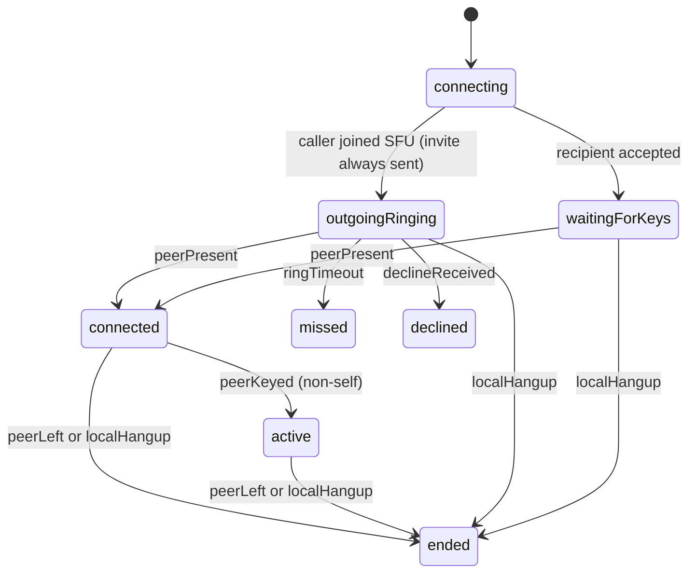

# Call State Machine

This document explains how `meeting_place_matrix` models the lifecycle of a
1:1 audio/video call, and the reasoning behind it. It is about the internal
state machine and its collaborators, not the public API surface, which is
covered by the package README.

Read the connection model first; the rest follows from it.

## The connection model

A call moves through three meaningful stages for each device:

1. **Ringing** — we have joined the SFU and are waiting for the other party.
2. **Connected** — the other party has joined the SFU room. The call is up.
3. **Active** — the other party's media has decrypted at least once (a peer
   E2EE `ok`). This is connected plus proven end-to-end media.

The signal that moves us from ringing to connected is **peer presence**: the
other party joining the SFU room. The signal that refines connected to active
is **peer keying**: a non-self participant reaching E2EE `ok`.

### Why presence, and not peer E2EE, is the connect signal

The theoretically pure signal would be "connected only once the peer's media
decrypts". We do not use that as the connect gate because this LiveKit and
Matrix stack does not deliver it symmetrically. In practice the party already in
the room when the other joins (typically the caller) often never subscribes to
the late joiner's track, so it never observes a peer frame-cryptor `ok`, even
though the call is genuinely up and the late joiner can hear it. The caller does
still receive the peer's key material over Matrix, but without a subscribed track
there is no frame-cryptor event to promote on.

Gating connection on peer E2EE therefore leaves the caller ringing forever on a
call that is actually working. So peer presence is the connect signal, and peer
keying is a refinement (`connected -> active`) rather than a precondition. This
matches the behaviour the team validated in end-to-end testing.

We still refuse the two weakest signals:

- **Our own media keying is not connection.** The local track keys as soon as we
  publish, regardless of any peer, so it can never promote the call.
- **A stored Matrix membership is not connection.** Membership is stale after
  ungraceful exits and drives callId discovery, not call state.

### The ghost caveat

A LiveKit SFU room is shared per Matrix room and outlives any single call. When
a device disconnects ungracefully (app kill, hot restart, lost network), the SFU
keeps its participant as a **ghost** until a ping timeout elapses, around fifteen
seconds. Because we connect on presence, a ghost still listed when we join
briefly looks like a peer and connects the call, then ends it when the ghost
times out. This is a narrow edge: it needs the other party to have crashed within
the last fifteen seconds and to not answer the new call.

The clean removal is to promote on the peer's **key receipt** rather than bare
presence: a live peer sends its E2EE key over Matrix, a ghost never does. That
signal lives in the Matrix VoIP layer and is not yet surfaced to this state
machine; wiring it through is the intended follow-up. Until then, presence is the
pragmatic connect signal and the ghost edge is accepted.

## States

Call state is a single `AudioVideoCallStatus` value plus the participant list,
owned by `AudioVideoCallService`.

| Status | Meaning |
| --- | --- |
| `idle` | No call in progress. |
| `connecting` | Resolving channel, credentials, and the callId; joining the SFU. |
| `outgoingRinging` | Caller has joined the SFU and sent the invite; waiting for the callee. |
| `waitingForKeys` | Recipient has joined an existing call and is waiting for the caller to appear. |
| `connected` | The other party is present in the SFU room. The call is up. |
| `active` | A non-self peer reached E2EE `ok`. Connected plus proven media. |
| `missed` | Outgoing call reached the ring timeout with no peer. |
| `declined` | Callee declined the outgoing call. |
| `ended` | A connected call ended (peer left, or local hangup). |
| `error` | Setup failed before a call could ring or connect. |

The caller and the recipient enter the machine through different doors
(`outgoingRinging` versus `waitingForKeys`) because they know different things:
the caller knows it initiated and must notify, the recipient knows a real caller
already invited it. Both reach `connected` the same way: the other party is
present.

## Events

Transitions are driven by explicit events, never by polling:

- **SFU connected** — the LiveKit room join completed.
- **peerPresent** — a non-self participant is in the room (a join event).
- **peerKeyed(participantId)** — a participant reached E2EE `ok`. Ignored when
  the id is our own.
- **peerLeft(participantId)** — a participant disconnected.
- **ringTimeout** — the outgoing ring timer elapsed with no peer.
- **declineReceived** — a `call-decline` signal arrived from the callee.
- **localHangup** — the local user ended the call.

## Transitions

Rules that carry the design:

1. **Presence connects; peer keying only refines.** The `outgoingRinging ->
   connected` edge is peer presence. `connected -> active` is a non-self peer
   keying. Our own key never crosses either edge.
2. **The caller always sends exactly one invite**, immediately after joining the
   SFU, before any peer is known. The ring timer is cancelled the moment a peer
   is present.
3. **`peerLeft` ends the call only from `connected` or `active`.** Before that we
   were never up, so a departing participant is ignored.

## Collaborators

The state machine is small because each surrounding concern lives in exactly one
place. `AudioVideoCallService` orchestrates; it does not resolve credentials,
track keys, decide rejoin, or route signals.

### `AudioVideoCallService` owns the machine

It holds the current `AudioVideoCallStatus`, the timers (ring timeout and the
recipient keying fallback), and the participant-change callbacks. It is the only
type that calls `_setState`. It reacts to the events above and nothing else.

### `CallE2EEHandler` reports peer keying

It tracks per-participant E2EE state and forces keyframe nudges when a decoder is
stuck. Its single output to the machine is **peerKeyed(participantId)**, fired
when a participant reaches E2EE `ok`. The service, not the handler, decides
whether that participant is us and therefore whether it refines the call to
`active`. The handler tracks keys; it does not know the state machine.

### `MatrixCallAdapter` owns signaling and callId resolution

It resolves the channel and credentials, decides which callId to register
against, sends the call-invite nudge, and cleans up the Matrix call on leave. It
answers one question for the machine, "what callId do we join", and performs one
side effect on request, "send the invite". It does not own call state.

The callId choice is a separate concern from connection state and is explained
below.

### `PendingCallManager` is the busy guard and remembers the current peer

It tracks ringing calls, the busy flag, and the identity of the party the device
is currently in a call with. The peer identity is what lets an incoming re-invite
from the party we are already talking to be recognised and ignored rather than
auto-declined. One call at a time, and re-invites from the current peer are not
treated as new calls.

### `CallSignalHandler` routes inbound signals

It receives the sealed `CallSignal` stream and dispatches invite and decline
signals. On an incoming invite it consults the busy guard: a new party while
busy is auto-declined, but a re-invite from the current peer is ignored with no
decline, so a caller reconnecting to a live call is never torn down.

## The callId is about E2EE generation, not connection

Both parties must land in the same MatrixRTC call generation, identified by a
`callId`, so their key exchange lands in the same place. This is why callId
selection exists and why it is deliberately independent of the connection state
machine:

- The **recipient** reuses the caller's in-progress callId so its keys reach the
  caller's generation. It discovers that callId from the caller's
  `m.call.member` state, retrying until its local Matrix client has synced the
  membership. This window has to outlast a cold `/sync` after an app restart, so
  it is generous (about fifteen seconds, well inside the caller's ring). If it
  ever exhausts, the recipient logs a warning and falls back to a fresh callId,
  which produces two generations and no E2EE, so the window is sized to make
  that outcome effectively unreachable in practice.
- The **caller** reuses an in-progress generation when one is present, so a
  caller rejoining a still-live call shares keys with the peer already there.
  When no generation is present it mints a fresh callId.

Because the SFU room is shared regardless of callId, presence works across
generations, but decryption does not. So two devices on mismatched callIds sit in
one SFU room and see each other join (presence still connects the call), but
their media never fully decrypts and neither reaches `active`. Matching the
callId is what makes `active` reachable.

> Note on determinism: discovery through synced room state is reliable once the
> window outlasts initial sync, but it is not instantaneous. The fully
> deterministic alternative is to carry the caller's callId in the call-invite
> itself (the same channel that already carries `mediaType`) so the recipient
> never has to discover it. That is the preferred long-term shape; the generous
> discovery window is the current mechanism.

## Invariants

These hold at all times and are the checklist for any change:

1. `connected` is reached only when a non-self participant is present; `active`
   only via a non-self `peerKeyed`.
2. The caller always sends exactly one invite per attempt, immediately after
   joining the SFU, before any peer is known.
3. Our own key never connects or refines the call.
4. `peerLeft` ends a call only from `connected` or `active`.
5. At most one call is active per device; a re-invite from the current peer is
   not a new call.
6. Every timer has an owner and is cancelled on the transition that makes it
   irrelevant (ring timer on reaching `connected`, keying fallback on
   `peerKeyed`).

## Consumer note: deriving "has had a peer"

Consumers that show an in-call timer or decide whether a departing peer should
end the call must derive "a real peer was here" from the call reaching a
connected status (`connected` or `active`), not from a remote participant merely
appearing in the list before the call is up. The reference app computes its
`hasHadPeer` latch from `isConnectedCallStatus` for this reason.

## What we deliberately do not do

- **We do not treat our own media keying as connection.** The local track keys
  regardless of any peer, so it cannot promote the call.
- **We do not suppress the invite based on stored membership.** The caller
  always notifies the callee. Membership state is stale after ungraceful exits,
  and suppressing the invite on it leaves the callee unaware.
- **We do not end a call when a pre-connect participant leaves.** Before
  `connected` we were never up, so a departing participant is ignored.
- **We do not auto-decline a re-invite from the party we are already in a call
  with.** That is a reconnect, not a competing call.
- **We do not poll for liveness or presence.** Every transition is event driven,
  from the SFU, the E2EE handler, a timer, or a signal.
