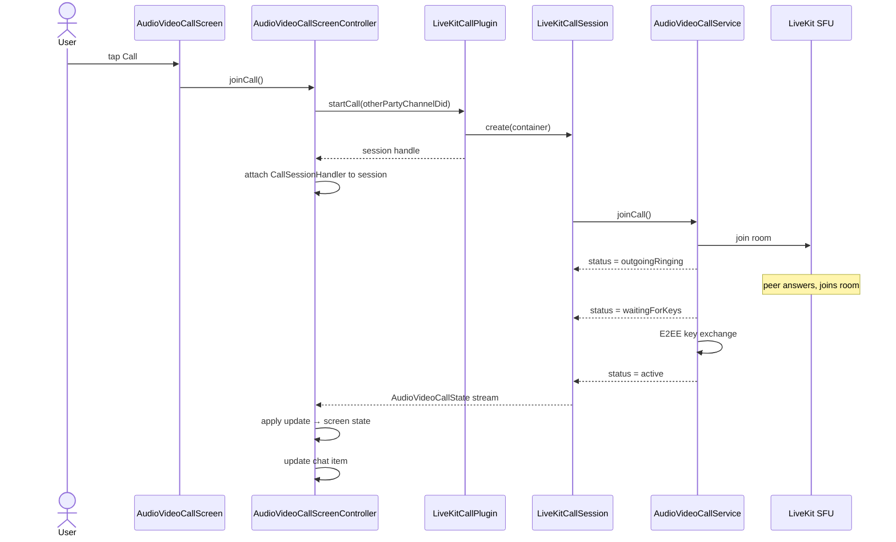
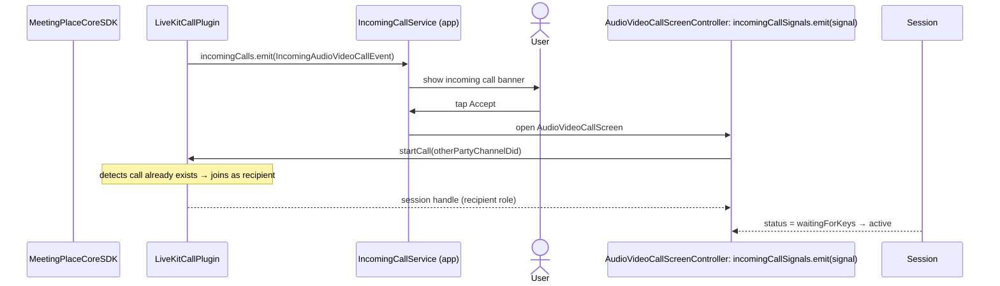
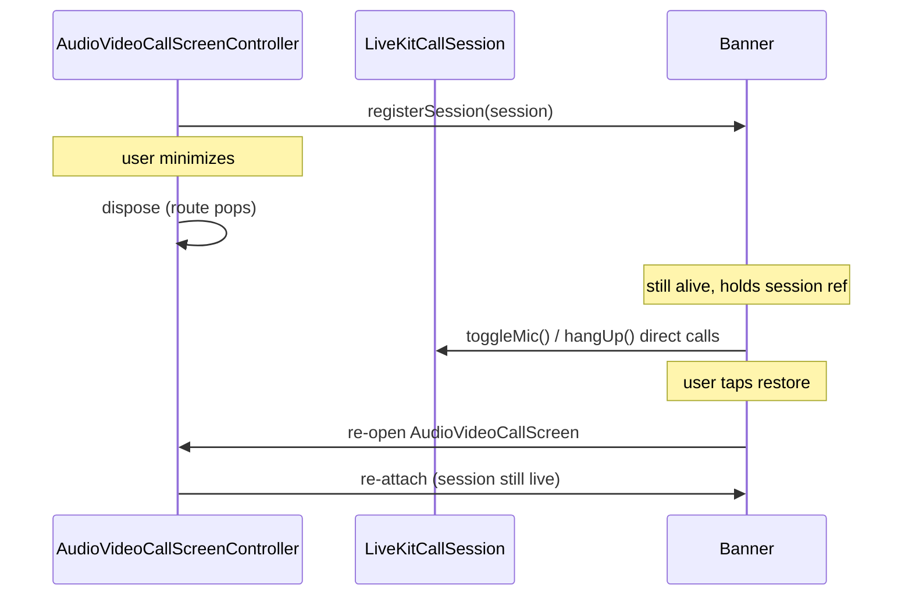
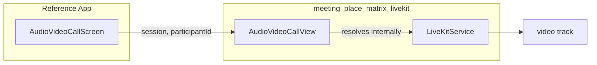

> ⚠️ **Temporary onboarding doc** — Delete after Phase 1 launch and team integration.  

# Video Calls — Architecture Overview

## Delivery Phases

Agreed three-phase rollout:

| Phase | Scope | Status |
|---|---|---|
| **1 — Individual calls (no key rotation)** | 1:1 audio/video, decline, missed call persistence | 🟡 Near-complete |
| **2 — Group calls (no key rotation)** | 3+ participants, group call UI (Figma not started) | ❌ Not started |
| **3 — Key rotation** | Per-participant E2EE keys, rotation on leave | ❌ Not started |

---

## Package Structure

```
meeting_place_chat          ← pure Dart. interfaces + models only. no Flutter.
meeting_place_matrix_livekit ← Flutter plugin. implements those interfaces.
reference app               ← imports interfaces only (except main.dart).
```

---

## Component Diagram

```mermaid
graph TD
    subgraph App["Reference App"]
        Screen["AudioVideoCallScreen"]
        ScreenCtrl["AudioVideoCallScreenController\n(family provider, disposes on pop)"]
        Handler["CallSessionHandler\n(plain Dart, no Riverpod)"]
        ChatHandler["CallChatItemHandler"]
        BannerCtrl["ActiveCallController\n(non-family, survives navigation)"]
        Banner["ActiveCallBanner"]
        Rules["call_ui_rules.dart\n(pure functions, source of truth)"]
    end

    subgraph Plugin["meeting_place_matrix_livekit"]
        Plugin["MeetingPlaceLiveKitCallPlugin\nimplements AudioVideoCallPlugin"]
        Session["LiveKitCallSession\nimplements AudioVideoCallSession"]
        Service["AudioVideoCallService\n(Riverpod notifier, state machine)"]
        LK["LiveKitService"]
        E2EE["E2EEKeyProvider\n(Olm to-device)"]
        SFU["SfuTokenService"]
    end

    subgraph Contracts["meeting_place_chat (interfaces)"]
        IPlugin["AudioVideoCallPlugin"]
        ISession["AudioVideoCallSession"]
        State["AudioVideoCallState\n(status + participants + role)"]
    end

    subgraph Core["meeting_place_core (SDK)"]
        CoreSDK["MeetingPlaceCoreSDK"]
        IncomingSignal["incomingCallSignals stream"]
        DeclineSignal["callDeclineSignals stream"]
    end

    Screen --> ScreenCtrl
    ScreenCtrl --> Handler
    ScreenCtrl --> ChatHandler
    ScreenCtrl --> BannerCtrl
    Banner --> BannerCtrl
    Handler --> Rules

    ScreenCtrl -->|holds| ISession
    BannerCtrl -->|holds| ISession

    Plugin -->|implements| IPlugin
    Session -->|implements| ISession
    Session --> Service
    Service --> LK
    Service --> E2EE
    Service --> SFU

    Plugin -->|subscribes| IncomingSignal
    Plugin -->|subscribes| DeclineSignal
    CoreSDK --> IncomingSignal
    CoreSDK --> DeclineSignal
```

---

## Sequence: Outgoing Call



---

## Sequence: Incoming Call



---

## Minimize / Restore



---

## Call State Machine

**Caller:**
```
idle → connecting → outgoingRinging → waitingForKeys → active → disconnecting → ended / declined / missed / error
```

**Recipient:**
```
idle → connecting → waitingForKeys → active → disconnecting → ended / declined / missed / error
```

| Status | Meaning |
|---|---|
| `connecting` | Joining the transport room |
| `outgoingRinging` | Caller is alone in the room; awaiting peer |
| `waitingForKeys` | Peer joined; ring timer starts; E2EE key exchange in progress |
| `active` | Media flowing, call live |
| `disconnecting` | Hang-up initiated, cleaning up |
| `ended` / `declined` / `missed` / `error` | Terminal states |

All UI label decisions (`Calling...` / `Ringing...` / timer) derived from `call_ui_rules.dart` — pure functions, no state. Change behavior here only.

---

## Plugin Wiring (`main.dart`)

The app declares a `FutureProvider<AudioVideoCallPlugin?>` in its infrastructure layer. The concrete type is only named once — in `main.dart` at the composition root:

```dart
// app/lib/main.dart
audioVideoCallPluginProvider.overrideWith((ref) async {
  final sdk = await ref.read(meetingPlaceSdkProvider.future);
  final plugin = MeetingPlaceLiveKitCallPlugin(
    options: MeetingPlaceLiveKitCallPluginOptions(
      livekitServiceUrl: Uri.parse(Environment.instance.livekitServiceUrl),
      livekitSfuUrl: Uri.tryParse(Environment.instance.livekitSfuUrl),
      outgoingCallTimeout: Environment.instance.outgoingCallTimeout,
    ),
  );
  plugin.initialize(sdk: sdk);
  return plugin;
});
```

Everywhere else in the app — controllers, services, widgets — holds `AudioVideoCallPlugin?` (the interface). `MeetingPlaceLiveKitCallPlugin` appears in one other place only: `app_controller.dart`, for teardown.

---

## Plugin's Isolated `ProviderContainer`

Every call session gets its own `ProviderContainer` — separate from the app's global Riverpod tree. The plugin creates it with four overrides injected at construction:

```
┌─────────────────────────────────────────────────────────┐
│              App ProviderScope (global)                 │
│  meetingPlaceSdkProvider, chatProvider, ...             │
│                                                         │
│  ┌───────────────────────────────────────────────────┐  │
│  │         Plugin ProviderContainer (per call)       │  │
│  │                                                   │  │
│  │  pluginCoreSdkProvider   → MeetingPlaceCoreSDK    │  │
│  │  pluginOptionsProvider   → LiveKitCallPluginOpts  │  │
│  │  pluginRtcDelegateProvider → FlutterMatrixRTCDel  │  │
│  │  pluginLoggerProvider    → MeetingPlaceCoreLogger │  │
│  │                                                   │  │
│  │  AudioVideoCallService(otherPartyChannelDid)       │  │
│  │    reads the four providers above                 │  │
│  │    owns LiveKitService, SfuTokenService, E2EE     │  │
│  └───────────────────────────────────────────────────┘  │
└─────────────────────────────────────────────────────────┘
```

`AudioVideoCallService` is annotated with `@Riverpod(dependencies: [...])`. This tells the code generator: *this provider is only valid inside a container that overrides these four providers.* It's a compile-time guard — the service cannot be accidentally read from the global app tree where those overrides don't exist.

All other SDK services run in the global container. The call plugin needs an isolated container because each call session owns independent SDK state (Matrix room id, call id, timers, key provider) that must be disposed cleanly when the session ends — without affecting the rest of the app.

---

## Video Rendering

The plugin does **not** own any screen. It exports one widget — `AudioVideoCallView` — which the app embeds to render a participant's video track.



The app passes the `AudioVideoCallSession` token. The widget resolves its own internals — the app never touches `LiveKitService` or any LiveKit type directly.

---

## What Was Built (Phase 1)

### SDK — `meeting_place_matrix_livekit`

| Area | Status |
|---|---|
| Plugin package scaffold (`meeting_place_matrix_livekit`) | ✅ Done |
| `AudioVideoCallPlugin` + `AudioVideoCallSession` interfaces (pure Dart, `meeting_place_chat`) | ✅ Done |
| LiveKit room join/leave, mic/camera toggles, speaker toggle | ✅ Done |
| E2EE — `BaseKeyProvider`, Olm to-device key distribution | ✅ Done |
| E2EE late-joiner fix (key request via `m.call.encryption_keys_request`) | ✅ Done |
| `outgoingRinging` status + outgoing ring timer + timeout | ✅ Done |
| Call decline signal (`callDeclineSignals` stream) | ✅ Done |
| SFU token service (`/sfu/get` via lk-jwt-service) | ✅ Done |
| `CallRole` (caller vs recipient) on `AudioVideoCallSession` | ✅ Done |
| Unit tests (`AudioVideoCallService`, `MeetingPlaceLiveKitCallPlugin`, `SfuTokenService`) | ✅ Done |
| **Missed call persistence** (receiver never answers) | ❌ Not done |
| **Per-participant E2EE keys** (currently shared key, no rotation) | ⚠️ Phase 3 |

### App — `feat/audio-video-call-screens`

| Area | Status |
|---|---|
| `AudioVideoCallScreen` + `AudioVideoCallScreenController` | ✅ Done |
| `CallSessionHandler` (decouples session events from controller) | ✅ Done |
| `ActiveCallController` + `ActiveCallBanner` (survives screen disposal) | ✅ Done |
| Call UI rules engine (`call_ui_rules.dart`, `call_chat_item_rules.dart`) | ✅ Done |
| Call chat item — sender side (send on start, update on end) | ✅ Done |
| Call chat item — receiver side (incoming → answered → duration) | ✅ Done |
| `CallChatItemCard` widget | ✅ Done |
| l10n strings (en / de / es) | ✅ Done |
| Power-level fix (both parties get power 100 at room creation) | ✅ Done |
| Unit + widget tests (controller, chat service, rules) | ✅ Done |
| **Missed call persistence** (app-side wiring) | ❌ Not done |

---

## Unblock Phase 1 → Publish

| Item |
|---|
| Missed call persistence (SDK + app wiring) |
| PR review + API contract sign-off |
| SDK PR merge strategy (SDK first, then app) |
